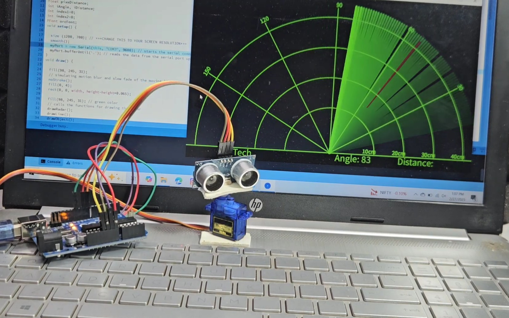
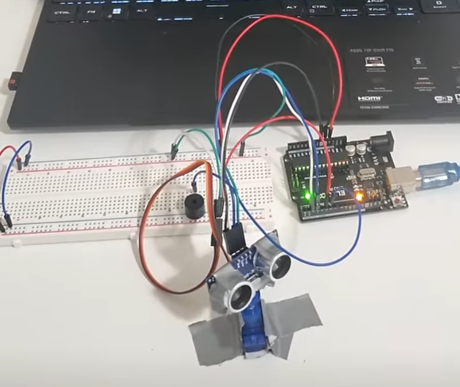
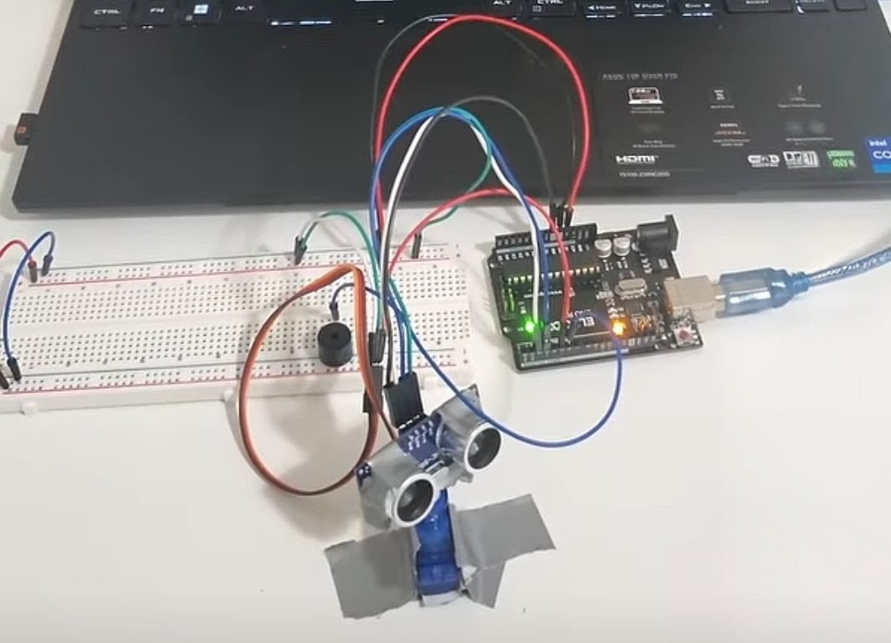
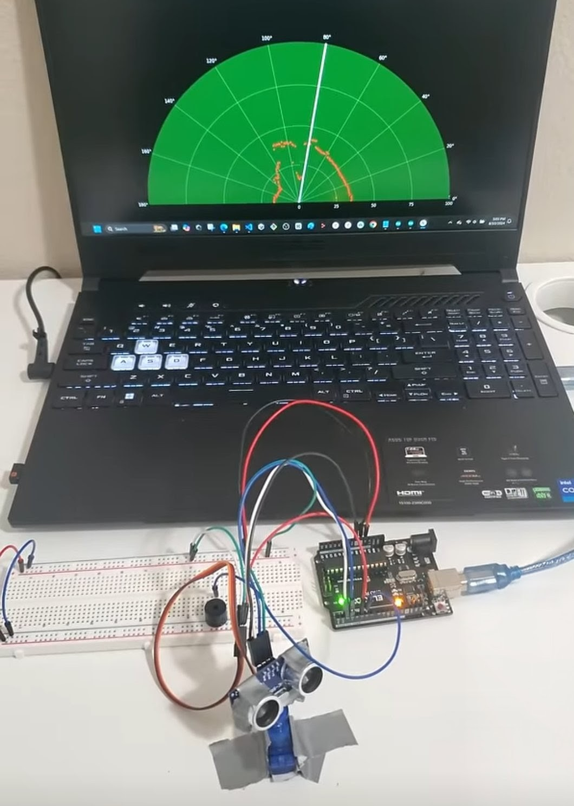
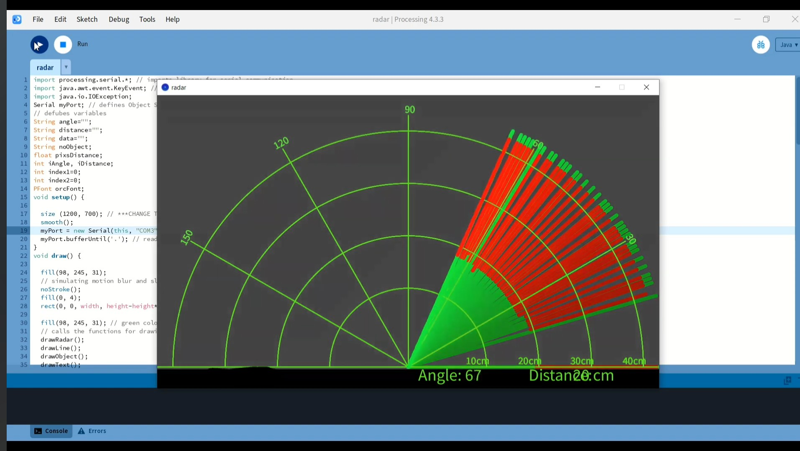

# Arduino Radar System

This project implements a radar system using Arduino and an ultrasonic sensor to detect objects in real-time. A servo motor rotates the sensor, and detected objects are visualized on a radar-like interface.

## Features
- Real-time object detection
- 180° scanning using servo motor
- Distance measurement using ultrasonic sensor
- Radar-style visualization

## Components Used
- Arduino Uno
- Ultrasonic Sensor (HC-SR04)
- Servo Motor
- Jumper Wires
- Breadboard

## Applications
- Obstacle detection
- Robotics navigation
- Smart surveillance projects

## Future Improvements
- Longer detection range
- Wireless monitoring
- IoT integration

## Author
Md Istaque Ansari  
Electronics & Communication Engineering Student  
Focused on Embedded Systems & Real-World Hardware Projects.
## Project Demo

